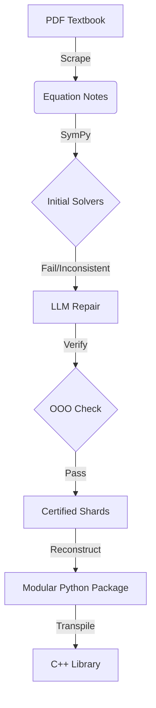

# Vakyume: PDF to C++ Library Pipeline

Vakyume is a pipeline for transforming legacy engineering knowledge—specifically vacuum system design—into verified, high-performance Python and C++ libraries. Inspired by the 1986 edition of *Process Vacuum System Design and Operation* by Ryans and Roper, the project uses a "One-Odd-Out" (OOO) verification methodology to ensure mathematical consistency across all generated solvers.

---

## v0.2 core: residual-verified solvers

The core no longer generates one solver file per variable. Each equation is
stored once, and solving for any variable follows a deterministic policy:

1. **Peel and solve exactly.** Invert the outer operations around the target
   (`+`, `*`, fractional powers, `exp`, `log`). Float exponents such as `**0.286`
   are rationalized first. If the target is then isolated, that's a closed form.
   If what remains is a polynomial in the target, every real root comes from
   `numpy.roots`. Both are *complete*: every real root is found.
2. **`sympy.solve`** runs in a killable worker with a timeout, and its results
   are cached. It is used only when step 1 can't finish.
3. **Numeric scan** over a symmetric log grid, for transcendental cases.
   Results from steps 2 and 3 are flagged `complete=False`.

Every candidate is substituted back into the original equation and kept only
if the scaled residual is below 1e-9. The solver applies only the domain the
math implies (real values, principal branches). Physical context comes from
the caller:

```python
from vakyume import Library

lib = Library.load("projects/VacuumTheory")
lib["2-1"].solve(rho=1.2, D=0.1, v=3.0, mu=1.8e-5)         # kwasak-style: solves for Re
lib["2-5"].solve(q=10, delta_P=5, L=2, mu=0.01)             # AmbiguousSolution: D = +/-...
lib["2-5"].solve(q=10, delta_P=5, L=2, mu=0.01, where=lambda D: D > 0)
lib["2-5"].solve(q=10, delta_P=5, L=2, mu=0.01, select="all")  # Solution(roots, complete, method)
```

```bash
uv sync                                   # Python >= 3.11
uv run vakyume list projects/VacuumTheory          # equations and parsed kinds
uv run vakyume solve projects/VacuumTheory 2-1 rho=1.2 D=0.1 v=3 mu=1.8e-5
uv run vakyume report projects/VacuumTheory --jobs 4   # CPU heavy: verifies everything
uv run pytest                              # fast tests; `-m slow` for whole projects
```

`vakyume report` checks each variable of every equation. It samples
consistent points, hides one value, solves for it, and requires two things:
every root satisfies the equation (re-checked with SymPy at 30 digits), and
the hidden value is recovered. It writes `docs/STATUS.md` and
`docs/status.json`, which `make-docs` now uses instead of a hard-coded
"certified". Relations that aren't scalar algebra are reported rather than
turned into broken solvers. That covers inequalities, open-ended sums,
derivatives, `U(B)` calls, cross products, and operands lost in extraction
such as `F = *x`.

The LLM is no longer needed to fill gaps in solving. The original
scrape → shard → verify → LLM-repair pipeline below still works with
`uv sync --extra legacy`.

---

## The Core Pipeline (legacy)

Vakyume automates the path from a textbook PDF to a compiled binary through an eight-stage orchestration.



### 1. Extraction & Parsing
*   **Scraper**: Uses PyMuPDF and SLMs (Phi-3/Llama-3) to identify numbered equations and variables.
*   **Notes**: Equations are stored in a human-readable Python format (`lhs = rhs`).

### 2. One-Odd-Out (OOO) Verification
For any equation (e.g., $PV=nRT$), Vakyume generates solvers for every variable ($P, V, n, R, T$). 
*   **Consistency Check**: It picks a random input, solves for one variable, and then uses that result to solve for the others. 
*   **Harmony**: If the results don't satisfy the original equation within a $1e-4$ tolerance, the solver is flagged for repair.

### 3. LLM-Assisted Repair
When symbolic solvers (SymPy) fail on transcendental or complex engineering forms, Vakyume uses LLM-assisted repair. The LLM is given the equation, a working example shard from the same family, and concrete expected-vs-got test cases to produce a corrected solver function.

### 4. Multi-Target Synthesis
*   **Python**: Generates a modular package (`py/`) with the `@kwasak` decorator for automatic variable dispatch.
*   **C++**: Transpiles Python AST to C++17, utilizing `std::complex` and custom `LambertW` implementations.
*   **Documentation**: Generates an **Equation Certification Report** (`docs/`) with LaTeX-rendered formulas and variable definitions for peer review.

---

## Project Structure

```text
projects/
└── VacuumTheory/
    ├── notes/           # Input: Equation definitions
    ├── shards/          # Intermediate: Individual solvers
    ├── reports/         # Analysis and verification logs
    ├── docs/            # Output: Equation Certification (LaTeX/MD)
    ├── py/              # Output: Modular Python package
    └── cpp/             # Output: C++ headers and source
```

---

## Quick Start

### Installation
```bash
python3 -m pip install sympy scipy timeout-decorator numpy httpx ollama pymupdf
```

### Build a Project
```bash
# End-to-end: Scrape, Verify, Repair, and Transpile
python3 vakyume.py build projects/MyProject --pdf textbook.pdf
```

### PDF to C++ in Five Commands

```bash
# 1. Scrape equations from a PDF (launches interactive wizard)
python3 vakyume.py scrape path/to/textbook.pdf -o projects/MyProject/notes

# 2. Run the pipeline: shard, verify, repair
python3 vakyume.py run projects/MyProject

# 3. Reconstruct verified shards into a Python package
python3 vakyume.py reconstruct projects/MyProject

# 4. Transpile to C++ and compile
python3 vakyume.py make-cpp projects/MyProject

# 5. Generate an Equation Certification Report
python3 vakyume.py make-docs projects/MyProject
```

---

## The `make-docs` Command

Generates an **Equation Certification Report** in Markdown with LaTeX-rendered
formulas. The report is written to `docs/EQUATION_CERTIFICATION.md` inside the
project directory and includes every extracted equation, its variable
definitions, and verification status.

```bash
python3 vakyume.py make-docs projects/VacuumTheory
```

The output is a peer-reviewable document suitable for rendering on GitHub or
any Markdown viewer with LaTeX support.

---

## The `scrape` Command

Extracts numbered equations from a PDF textbook into vakyume notes files
using PyMuPDF for text extraction and a local Ollama LLM for equation
identification.

### Default: Interactive Wizard

Running `scrape` without `--chapters` launches an interactive wizard that
walks you through model selection and chapter picking:

```bash
python3 vakyume.py scrape textbook.pdf
```

```
============================================================
  VAKYUME PDF Equation Scraper - Interactive Wizard
============================================================

  PDF: textbook.pdf

--- Model Selection ---
  Available Ollama models:
    [1] llama3:latest (default)
    [2] phi3:latest
    [3] llama3.2:latest

  Select model [1-3] (Enter for default):

--- Chapter Selection ---
  Found 28 chapters in PDF:

    [ 1] Introduction (12 pages)
    [ 2] The Scientific Method (8 pages) [auto-skip: non-equation content]
    [ 3] Kinematics (32 pages)
    ...

  Options:
    - Enter chapter numbers separated by commas (e.g., 3,5,9)
    - Enter a range with a dash (e.g., 3-9)
    - Press Enter to process ALL chapters
    - Type 'one' to pick a single chapter (good for testing)

  Chapters to process: 10
```

### Bypassing the Wizard

```bash
# Process specific chapters directly (no wizard)
python3 vakyume.py scrape textbook.pdf -c 3 5 9

# Process a range
python3 vakyume.py scrape textbook.pdf -c 3 4 5 6 7 8 9

# Process all chapters without prompting
python3 vakyume.py scrape textbook.pdf --no-wizard

# Override the model (wizard still runs for chapter selection)
python3 vakyume.py scrape textbook.pdf -m phi3:latest

# Override the model AND skip the wizard
python3 vakyume.py scrape textbook.pdf -m phi3:latest -c 10

# List available chapters without processing
python3 vakyume.py scrape textbook.pdf --list-chapters

# Quiet mode (suppress progress, useful for piping)
python3 vakyume.py scrape textbook.pdf -c 10 -q
```

### Scraper Tips

- **Start with one chapter** to test quality before running the full book.
  The `one` shortcut in the wizard makes this easy.
- **llama3 produces better results** than phi3: proper equation numbering,
  fewer hallucinations, cleaner variable naming.
- **Use `PYTHONUNBUFFERED=1`** when piping output to a log file to avoid
  empty logs (Python buffers stdout by default when piped):
  ```bash
  PYTHONUNBUFFERED=1 python3 vakyume.py scrape book.pdf -c 10 2>&1 | tee scrape.log
  ```
- **Chapters without equations** (methods, lab guides, programming tutorials)
  are auto-skipped based on a built-in skip list.

---

## Conclusion

Vakyume is a proof of concept that is, at this point, anachronistic to the
wonders of modern LLMs. I started building it when Phi-3 first came out,
stitching together SymPy solvers with small local models to get from PDF
equations to working code. In the end, this kind of manual hybrid pipeline
doesn't work very well -- too many failure modes, too much glue code, and
too brittle to scale gracefully.

That said, I learned a tremendous amount about coding and life through making
this. Symbolic math, AST manipulation, C++ transpilation, and OOO verification.

Today, a free tool like the Gemini CLI could vastly outshine this entire
pipeline in a single prompt. The world moved fast, and Vakyume is a snapshot
of what it took to do metaprogram the hard way before it became easy.


